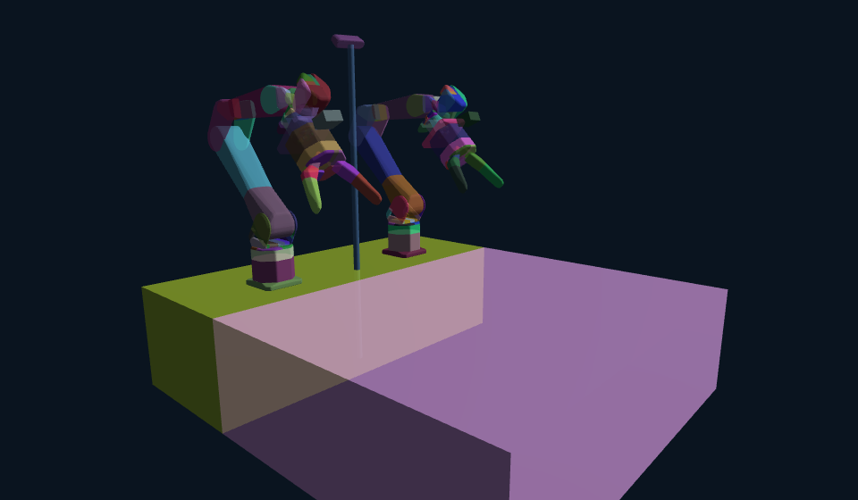

# Genesis firefly — dual-arm manipulation + photoreal data collection (Line B)

Reproduction of the RoboLab_firefly (IsaacLab/PhysX) dual **Firefly Y6 + GR100** pick-place stack in the
**Genesis** simulator, with **RTX-grade Nyx** rendering, **full domain randomization**, and **fully-parallel**
god-mode data collection for VLA (pi0.5) fine-tuning.

The design rule: a **reusable robot-manipulation + rendering SETUP** that you never re-tune, with **TASKS**
layered on top. You build a new task by swapping objects + a skill + a scorer — never the robot, cameras,
rendering, backgrounds, collision, or the parallel harness.

```
ManipulationStage  (world/manipulation_stage.py)    ← the SETUP (never re-tune)
  ├─ robot      : dual Firefly Y6 + GR100, baked SOMA livery, matte override, convex-decomposed collision
  ├─ tables     : 2 static collidable tables
  ├─ cameras    : 2 egocentric wrist D405 + 1 side D435i (policy stream) + 1 witness + visible side body/stick
  ├─ rendering  : Nyx path tracer (PBR), sensor read() egocentric wrist cams
  └─ env DR     : per-env IMMERSIVE HDRI background (each parallel env = its own real room), 2K (E≤45) else 1K pool
FULL-DR HARNESS  (dr/)                                ← scope A+C automatic, scope B per-object; FULLY applied
SKILLS  (skills/)  grasp · place · grasp_retry · trajectory · executor · score · distractors · penetration
TASK    (tasks/pickplace.py)                          ← thin composer: objects + DR + skills + score + write
```

## Quick start
```bash
# 20 fully-parallel cube→bowl demos, full DR, photoreal, one build
CUDA_VISIBLE_DEVICES=0 ./.venv/bin/python genesis_firefly/tasks/pickplace.py 20 7
#   -> /data3/genesis_fulldr/demos.hdf5  + videos/cam_{side,lw,rw}/demo_*.mp4   (the fine-tune dataset)
#   -> output/temp/fulldr_collect/fulldr_third_20.mp4 (√N tile) + fourview_demo_*.mp4 (four-view 2×2 tiles)
# any registry object: TARGET=banana ...;  opt-in miss→retry: NOISE_RETRY=0.45 ...
# knobs: TARGET, DATA_DIR, OUT_DIR, FAST, SPP (32), NOISE_RETRY. Entry wrapper: genesis_firefly/runner/collect.py

# scale to a full-DR dataset on /data3 (B subprocess builds × E envs, one sim process per GPU, merged):
GPUS=0,1 ./.venv/bin/python genesis_firefly/runner/orchestrate.py 10 20 7 cube_fulldr_v3

# render-check the setup:
CUDA_VISIBLE_DEVICES=0 ./.venv/bin/python genesis_firefly/world/manipulation_stage.py
```

## Reference result
Full-DR cube→bowl collection `cube_fulldr_v3` (10 builds × 20 envs): **200 demos · 197 placed · 0 abnormal
penetration**, ~50/50 left/right arm, natural variable-length motion → LeRobot `genesis_cube_fulldr_v3` (197
episodes, pi0.5-ready). All five objects (cube/apple/banana/tennis/pen) solve with real native textures.
Collision is in good mode (convex-decomposed arm/gripper/camera colliders, self-collision on, firm Newton solver
+ per-object noslip — see the collider image below).



## Docs
| doc | what it covers |
|-----|----------------|
| [project_overview.md](project_overview.md) | **The big blueprint** — mission, the end-to-end sim-to-real pipeline, SETUP-vs-TASK, the harnesses, the agency layer (DR-strategist + object-refiner), the modular skills, the `dr/` full-DR harness, build-batch parallelism, data contract, repo layout, and how to add a task. **Read this first.** |
| [domain_randomization.md](domain_randomization.md) | **The complete full-DR spec** for EVERY task — scopes A (scene), B (object/task), C (visual); the per-build vs per-env renderer constraint (+ the per-env→per-build light limit); pose anti-coupling rules; how the `dr/` package applies it. The authoritative DR reference. |
| [manipulation_stage.md](manipulation_stage.md) | **The reusable setup** — what it provides, the full API, and a copy-paste template for a new task. |
| [grasp_retry.md](grasp_retry.md) | The OBJECT-AGNOSTIC, opt-in miss→retry augmentation (the disturbance replacement) — the bimodal target-noise, the two-phase hold-free flow, knobs, and residuals. |
| [rendering_and_livery.md](rendering_and_livery.md) | Nyx photoreal rendering, immersive per-env HDRI DR, the matte override, the livery bakers, and every Nyx gotcha. |
| [robot_collision_cameras.md](robot_collision_cameras.md) | The dual arm, GR100 gripper, gains/IK, the "good mode" collision model, and the 3 cameras + side rig. |
| [pickplace_task_and_dataformat.md](pickplace_task_and_dataformat.md) | The cube→bowl task (thin composer), full DR, success/penetration scoring, the §4 HDF5 schema, and how to add a new task. |
| [agents.md](agents.md) | The agency layer — the DR-strategist + object-refiner contracts + their workbooks. |
| [object_refiner.md](object_refiner.md) | Raw object → SIM-READY asset (`registry/refine.py`): augment → infer → good collision → verify → keypoints. |
| [lerobot_export.md](lerobot_export.md) | Genesis HDF5 → LeRobot v2.1 (`dataio/convert_genesis_to_lerobot.py`) + the pi0.5 fine-tune commands. |
| [lessons_genesis_nyx.md](lessons_genesis_nyx.md) | Symptom→cause→fix logbook of every hard-won Genesis/Nyx finding (read before debugging). |
| [line_c_aero_plan.md](line_c_aero_plan.md) | Line C — integrating the AERO dexterous hand (research/plan; not started). |
| [roadmap.md](roadmap.md) | The living problem→change→why→result progress log. |
| [genesis_reproduction_plan.md](genesis_reproduction_plan.md) | The original two-line (RoboLab + Genesis) plan (historical). |

## Repo layout (`genesis_firefly/`)
```
world/manipulation_stage.py    the reusable SETUP (robot+cameras+rendering+immersive HDRI DR+parallel)
world/firefly_scene.py         TableLayout, firm_rigid_options (firm Newton solver + per-object noslip), BOWL_HALF_H
world/firefly_cameras.py       3 policy cameras + 1 witness + the visible side-camera body/stick rig
world/object_factory.py        the ONE spec→sim-entity builder (collision + visual + native texture)
robots/firefly_dual.py         dual-arm loader: livery URDF, 14-D layout, MIT gains, decomposed collision
robots/ik.py                   Genesis-native IK adapter (== SODA IK, proven identical)
dr/                            the reusable full-DR harness: scopes(A+C) · object_dr(B) · sampler · apply · plan · sweep
skills/                        grasp · place · grasp_retry · trajectory · executor · score · distractors · penetration
registry/object_spec.py        the object library (ObjectSpec/REGISTRY + keypoints); refine.py = object-refiner harness
tasks/pickplace.py             the cube→bowl TASK (thin composer on top of ManipulationStage)
runner/collect.py              entry point: one parallel build of N demos
runner/orchestrate.py          B subprocess builds × E envs → merge shards → /data3 + output symlink
dataio/convert_genesis_to_lerobot.py   HDF5 → LeRobot v2.1 export for pi0.5
scripts/bake_firefly_livery.py, bake_soma_panels.py   the livery bakers (run once -> the livery URDF + GLBs)
assets/                        URDF + meshes + the baked livery GLBs + bowl_clean.obj + object library + table textures
docs/                          you are here  (start with project_overview.md)
```

## Hard constraints (carried from RoboLab)
god-mode scripted collectors ↔ sensor-only policy (3 RGB + 14-D proprio + language); collision realism is
first-class; one sim process per GPU; the §4 HDF5 schema is a fixed contract (exporter reused unchanged).
