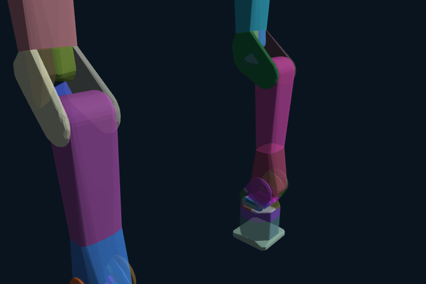

# Robot, collision model & cameras

Genesis "Line B" reproduction of the firefly dual-arm stack. This is the reference manual for **how the
robot is loaded, how its collision model is built (the "good mode"), how IK is solved, and how the three
policy cameras + the visible side rig are wired up.**

Everything here is sourced from the real code — quote, don't invent:

| Concern | File |
| --- | --- |
| Dual-arm loader, 14-D layout, PD gains, gripper | `robots/firefly_dual.py` |
| Collision options (firm rigid solver + per-object noslip), world, tables, bowl | `world/firefly_scene.py` |
| Cameras + visible side-camera rig | `world/firefly_cameras.py` |
| Genesis-native IK adapter (the one actually used in sim — PROVEN == SODA IK) | `robots/ik.py` |
| Object spec → sim-entity builder (collision + texture) | `world/object_factory.py` |
| SODA analytic IK bridge (real-robot only, via `soda-bimanual`) | (not vendored in this repo) |

All paths below are relative to `/home/kaitianchao/Projects/Genesis_world_kaitian/genesis_firefly/`.

> **Standing rule (owner #1):** collision is first-class. What cannot happen in reality must not happen
> in sim — two solids never interpenetrate. Verify with a tight close-up + a measured number, never a
> bare claim. The recipes below are the hard-won result of that rule; do not regress them.

---

## 1. The dual arm

### What loads by default

`robots/firefly_dual.py` loads ONE self-contained dual URDF. It prefers the **livery** URDF and falls back
to the plain one:

```python
ASSET = Path(__file__).resolve().parents[1] / "assets/robots/firefly_y6_gr100"
_PLAIN_URDF  = str(ASSET / "dual_firefly_y6_gr100.urdf")
_LIVERY_URDF = str(ASSET / "dual_firefly_y6_gr100_livery.urdf")
DUAL_URDF = _LIVERY_URDF if Path(_LIVERY_URDF).exists() else _PLAIN_URDF
```

- The **livery URDF** is the default. Its `<visual>` meshes are GLBs with the real Firefly Y6 SOMA materials
  baked in (silver metallic links, grey `link_4`, dark wrist/base, orange-carbon + silver-SOMA panels on
  `link_2`/`link_3`). Nyx reads a URDF's *embedded mesh* materials, so the livery URDF is what makes the true
  livery render. Built by `scripts/bake_firefly_livery.py`. Collision meshes stay plain STL.
- "Self-contained" = the mesh paths inside the URDF are rewritten relative to the URDF, so there is **no
  RoboLab dependency** — the asset tree stands alone under `assets/robots/firefly_y6_gr100/`.

### Genesis INTERLEAVES the dual-arm DOFs

This is the single most important gotcha. After loading the dual URDF, Genesis does **not** lay out the two
arms contiguously. It interleaves them: `left_joint_1 = dof0`, `right_joint_1 = dof1`, `left_joint_2 = dof2`,
... So you can **never** assume `[0:6]` is the left arm. The loader resolves every joint by **name** into its
Genesis dof index, after `scene.build()`:

```python
def _didx(self, jname: str) -> int:
    return int(self.entity.get_joint(jname).dofs_idx_local[0])
```

Joint names (match RoboLab exactly):

```python
LEFT_ARM_JOINTS  = [f"left_joint_{i}"  for i in range(1, 7)]   # left_joint_1 .. left_joint_6
RIGHT_ARM_JOINTS = [f"right_joint_{i}" for i in range(1, 7)]
LEFT_GRIPPER_DRIVEN_JOINT = "left_gripper_left_joint_1"
LEFT_GRIPPER_MIMIC_JOINT  = "left_gripper_right_joint_1"
RIGHT_GRIPPER_DRIVEN_JOINT = "right_gripper_left_joint_1"
RIGHT_GRIPPER_MIMIC_JOINT  = "right_gripper_right_joint_1"
LEFT_EE_LINK = "left_ee_link";  RIGHT_EE_LINK = "right_ee_link"
LEFT_LINK6 = "left_link_6";     RIGHT_LINK6 = "right_link_6"
```

### The 14-D policy/state layout

The policy state/action is **14-D = (6 arm + 1 driven gripper) × 2 arms**. The gripper *mimic* joints are
NOT in the state — only the driven joint, because the mimic is coupled at the action layer (see §2):

```python
STATE_JOINTS_14 = (LEFT_ARM_JOINTS  + [LEFT_GRIPPER_DRIVEN_JOINT]
                 + RIGHT_ARM_JOINTS + [RIGHT_GRIPPER_DRIVEN_JOINT])
```

Order: `[L1 L2 L3 L4 L5 L6  Lgrip  R1 R2 R3 R4 R5 R6  Rgrip]`. After `finalize()`,
`robot.state14_idx` is the list of 14 Genesis dof indices, in that order, for slicing observations/actions
out of the (interleaved) full dof vector.

### MIT-controller PD gains (do NOT retune)

These are reproduced **identically** from RoboLab_firefly's `ImplicitActuatorCfg` (the MuJoCo MIT controller):

```python
ARM_KP     = [200, 200, 200, 75, 15, 15]        # J1-3 proximal, J4-6 wrist
ARM_KV     = [12.5, 12.5, 12.5, 6.0, 0.31, 0.31]
ARM_EFFORT = [28, 28, 28, 10, 10, 10]
ARMATURE   = 0.01                                # reflected motor inertia on EVERY joint
GRIP_KP, GRIP_KV, GRIP_EFFORT = 200.0, 8.0, 10.0
```

**Why the wrist jitter (J5/J6 rolling) is NOT a gains problem.** The earlier wrist jitter came from two
sim-faithfulness gaps, both fixed faithfully so `kp/kv` can stay at RoboLab's stock values:

1. **`default_armature=0.01`** on the URDF. Genesis defaults `0.1` — 10× more reflected wrist inertia →
   lower damping ratio → the wrist rings. RoboLab/MuJoCo use `0.01`. This is set in the URDF morph (below).
2. **`integrator = gs.integrator.implicitfast`** in the RigidOptions (see §3). Genesis defaults
   `approximate_implicitfast`, which under-damps the implicit PD. The exact `implicitfast` is the
   MuJoCo/Isaac-equivalent. With both fixes the wrist tracks to ~0.2°, zero oscillation, at RoboLab's
   stock `kv=0.31`.

> Owner directive: reproduce the RoboLab arm INCLUDING its PID. Fix sim divergence via armature + integrator,
> **never** by changing `kp`/`kv`.

`gravity_compensation=1.0` on the robot material means the controller cancels the arm's **own** weight
(computed-torque control, like a real well-tuned arm), so the PD-tracked trajectory REACHES its commanded
pose instead of sagging ~2-3 cm short → the gripper closes CENTRED on the object. The grasped object is a
separate entity (no compensation), so it still falls under gravity and must be physically held by the grip.

### The morph + material that get added

```python
kw = dict(file=DUAL_URDF, fixed=True, merge_fixed_links=False, pos=pos,
          convexify=True, decompose_robot_error_threshold=0.05,
          default_armature=ARMATURE)
add_kw = dict(morph=gs.morphs.URDF(**kw),
              material=gs.materials.Rigid(gravity_compensation=1.0))
self.entity = scene.add_entity(**add_kw)
```

Home pose per arm and base height:

```python
FIREFLY_HOME = [0.0, -0.75, 2.3, 0.9, 0.0, 0.0]
BASE_Z = 0.25    # arm-table height; dual base offsets (LEFT y=+0.224, RIGHT y=-0.224) are IN the URDF
```

### Usage (the build → finalize contract)

```python
from robots.firefly_dual import FireflyDual
robot = FireflyDual(scene, pos=(0, 0, 0.25))   # add to scene BEFORE build
# ... add tables / objects / cameras ...
scene.build()
robot.finalize()                                # MANDATORY after build: resolves dof indices, pushes gains
q = robot.home_qpos()                           # full dof vector at home (arms=FIREFLY_HOME, grippers open)
```

`finalize()` resolves `robot.arm` (`{"left":[6 dofs], "right":[6 dofs]}`), `robot.grip_driven`,
`robot.grip_mimic`, `robot.state14_idx`, `robot.ee`, and **pushes the PD gains / effort limits** via
`set_dofs_kp / set_dofs_kv / set_dofs_force_range`. Skipping `finalize()` leaves the entity with default
gains and no dof maps.

Commanding an arm + gripper (gripper coupling handled here, see §2):

```python
robot.command("left", arm_q6, grip)            # PD-target 6 arm joints + coupled gripper
pos, quat_wxyz = robot.ee_pose("left")         # returns numpy; Genesis natively gives CUDA tensors
```

`ee_pose()` already does the `.cpu().numpy()` conversion. Quaternions are **wxyz**.

---

## 2. The GR100 gripper

The gripper is two opposing fingers driven by ONE joint. The mimic joint is **not** a URDF `mimic`; it's
coupled at the action layer so it works identically across sims.

```python
GR100_OPEN  = 0.0
GR100_CLOSE = 0.9    # firm-pinch COMMAND (the PD presses hard toward this)
GR100_MIMIC = -1.0   # right_claw = -1 * driven (URDF axis flipped to match MuJoCo); coupled in action
GR100_MEET  = 0.58   # the fingers' pads just MEET here (measured: 0.1mm gap at q=0.59)
```

`command()` writes the driven joint to `grip` and the mimic to `GR100_MIMIC * grip`:

```python
def command(self, side, arm_q, grip):
    self.entity.control_dofs_position(np.asarray(arm_q, np.float32), self.arm[side])
    self.entity.control_dofs_position(
        np.asarray([grip, GR100_MIMIC * grip], np.float32),
        [self.grip_driven[side], self.grip_mimic[side]])
```

### The firm pinch

To grasp, you **PD-close firmly toward `GR100_CLOSE = 0.9`** and let the OBJECT stop the jaws (a cube stops
them at `q ≈ 0.41`). The firm squeeze force comes purely from the PD pressing toward `GR100_CLOSE`:
`GRIP_KP=200, GRIP_KV=8, GRIP_EFFORT=10`. Empirically, **raising effort HURT stability** (effort 10→20 made
the carry swing worse), so 10 is the tuned value.

> Do **not** clamp the gripper during a grasp. The hard clamp at `GR100_MEET=0.58` capped the grip → loose/
> asymmetric → slip. Let the jaws close to `GR100_CLOSE`; the object stops them.

### `GR100_MEET` clamp — empty-close only

`GR100_MEET` is the firm mechanical close stop. `clamp_gripper()` is called **after every `scene.step()`**
to stop the thin scissoring fingers from over-rotating / crossing on an **empty** close (Genesis's soft
joint-limit + self-contact won't hold them under the firm PD). When grasping, object contact stops the
fingers EARLIER, so the clamp only engages on an empty close:

```python
def clamp_gripper(self):
    q = self.entity.get_dofs_position(); q = q.cpu().numpy() if hasattr(q, "cpu") else np.asarray(q)
    for side in ("left", "right"):
        d, m = self.grip_driven[side], self.grip_mimic[side]
        if q[d] >  GR100_MEET: self.entity.set_dofs_position([ GR100_MEET], [d], zero_velocity=True)
        if q[m] < -GR100_MEET: self.entity.set_dofs_position([-GR100_MEET], [m], zero_velocity=True)
```

---

## 3. Collision model — the "good mode"

This is the crux of Line B and the owner's #1 rule. The recipe below is proven: a **100-run collection
measured 0 finger/cube penetration**. Do not regress any of it.

### 3a. Robot collider = convex DECOMPOSITION (not a single hull)

The default Genesis behaviour for `convexify=True` is to give each link **one** convex hull, and
`decompose_robot_error_threshold` defaults to `inf` → the curved GR100 finger's hull FILLS its concavity, so
the (real) visual finger pokes through an object the fatter, wrong-shape hull never contacts. The fix:

```python
gs.morphs.URDF(file=DUAL_URDF, fixed=True, merge_fixed_links=False, pos=pos,
               convexify=True, decompose_robot_error_threshold=0.05,   # <-- the good mode
               default_armature=ARMATURE)
```

Every robot mesh is **convex-decomposed (coacd) to a finite 0.05 error**, so each collider faithfully HUGS
its visual mesh. The solid finger then contacts the solid object exactly where it looks like it does — no
inflated single hull, no inflated-hull hack, no penetration. Collision = the real L1/L2 finger mesh.

### 3b. Collider verification image

The semi-transparent coloured hulls are the actual decomposed colliders, overlaid on the visual meshes
(robot loaded with `vis_mode="collision"` via the loader's `surface=` arg). The finger/link colliders
**hug** their visual geometry — note the gripper finger hulls track the curved fingers tightly, and there is
no fat single envelope. This is what "good mode" looks like:



### 3c. Firm rigid solver (the penetration fix)

From `world/firefly_scene.py`, `firm_rigid_options()` reproduces RoboLab's PhysX firm-contact recipe
(Newton solver, many iterations, low constraint timeconst, self-collision on, per-object `noslip_iterations`):

```python
def firm_rigid_options(dt=0.01):
    return gs.options.RigidOptions(
        dt=dt, constraint_solver=gs.constraint_solver.Newton, iterations=120,
        constraint_timeconst=0.005, enable_self_collision=True, enable_collision=True,
        integrator=gs.integrator.implicitfast)
```

- `constraint_solver=Newton`, `iterations=120` — stiff constraint resolution.
- `constraint_timeconst=0.005` — low time constant = harder contacts. (It is floored at `2 · solver_dt`,
  so substeps below is the real stiffness knob.)
- `enable_self_collision=True` — the two arms (and the scissoring fingers) collide with each other.
- `integrator=implicitfast` — exact MuJoCo/Isaac implicit PD (the approximate default under-damps J5/J6).

And `substeps=4` in the SimOptions — the solver runs at `dt/4` so contacts resolve HARD. Measured:
`substeps=1` let a finger sink **32 mm** into a cube; `substeps=4` → **~1.5 mm**. This is the real fix for
GR100↔object penetration, not lowering grip force. `substeps=8` destabilised (launched cubes); keep `4`.

```python
self.scene = gs.Scene(sim_options=gs.options.SimOptions(dt=0.01, substeps=4),
                      rigid_options=firm_rigid_options(), show_viewer=False)
```

### 3d. What else is collidable

| Body | Where | Collidable? |
| --- | --- | --- |
| Arm-table (0.34×0.90, top z=0.25) | `add_tables()` Box, `fixed=True, collision=True` | yes |
| Object-table (0.70×0.90, top z=0.25) | `add_tables()` Box, `fixed=True, collision=True` | yes |
| Side-camera **body** (real D435i mesh) | `add_side_camera_rig()` Mesh, `collision=True` | yes |
| Side-camera support **stick** (r=8 mm) | `add_side_camera_rig()` Cylinder, `collision=True` | yes |
| Wrist D405 camera bodies | baked into the dual URDF as collidable links | yes |
| Robot (both arms + grippers) | URDF, convex-decomposed (§3a) | yes |
| Ground plane | `scene.add_entity(gs.morphs.Plane())` | yes |

The two tables are solid, the **side camera rig is solid (body + stick)**, and the **wrist camera bodies are
collidable in the URDF** — so the arm can't pass through its own cameras or the rig. (Note: the photoreal
data collector drops the ground Plane to use an immersive HDRI backdrop; the world here keeps it.)

### 3e. Bowl collision (container — concave)

The bowl uses convex **decomposition** too — the same approach RoboLab/PhysX bakes — because a single
nonconvex-SDF envelope gives a degenerate ~0 contact where a box corner straddles the 2–3 mm rim → the cube
tunnels through the wall:

```python
gs.morphs.USD(file=str(BOWL_USD), pos=(...), scale=scale,
              convexify=True, decompose_object_error_threshold=0.04, decimate=False)
```

The thin shell splits into solid convex hulls tiling wall+floor; convex-vs-convex contact is robust
everywhere including the rim, so a cube landing on the rim rolls in/out and can never pass through.
(coacd raises the rest height a few mm — cosmetic, accepted, as RoboLab does.)

> Container placement rule (not a collider issue but the *other* big penetration cause): **release the
> gripped object ABOVE the rim and let it free-drop.** A position-controlled arm (kp=200) will DRIVE a held
> cube THROUGH any wall if you command a target below the rim — no collider can stop an actuator. Never lower
> a held object to a target inside the wall.

### 3f. Empirical result

100-run collection: **0 finger/cube penetration**; cube pick-place solved end-to-end with 0.00 mm measured
penetration and a firm/stable grasp (carry swing 60°→0°). No kinematic attach, no weld — real friction grip.

---

## 3g. Penetration detector (the owner's #1 enforcement gate)

Collision correctness being a claim is not enough — it must be **measured and enforced every demo**. A faithful,
batched penetration monitor (`skills/penetration.py`) reads the **true** interpenetration depth straight from
the solver and **rejects** any demo with abnormal overlap, so poisoned/unphysical data never ships. (Owner
directive #1; see `docs/project_overview.md` §0b.)

### The solver API it reads (faithful — NOT `entity.get_contacts`)

Genesis's rigid solver keeps a **persistent per-env contact buffer** in
`scene.rigid_solver.collider._collider_state.contact_data` (physical layout `(n_contacts_max, n_envs)`):

| field | meaning |
| --- | --- |
| `contact_data.penetration` | per-contact overlap depth in **metres, positive == the two geoms interpenetrate** |
| `contact_data.geom_a` / `geom_b` | the two global geom indices of the contacting pair |
| `n_contacts` (shape `(n_envs,)`) | #live contacts per env; slots `>= n_contacts[e]` are stale padding |

The sign convention is confirmed in the engine: `genesis/engine/solvers/rigid/collider/box_contact.py:91`
(`penetration = sphere_radius - dist`, positive when overlapping) and
`genesis/engine/solvers/rigid/constraint/solver.py:698` (the constraint solver consumes `-penetration` as the
position error → MuJoCo convention, positive == deeper overlap). The detector reads these buffers **directly**
via `qd_to_torch(..., transpose=True, copy=False)` (a zero-copy Quadrants→torch view).

**Why `get_contacts` is avoided.** `collider.get_contacts(...)` runs a torch `gather` over `contact_sort_idx`
whose dtype is not int64 in this build, so the moment contact pruning/spatial-sort is active it raises
`RuntimeError: gather(): Expected dtype int64 for index` (verified live). `entity.get_contacts` wraps that same
gather (it is the "buggy `get_contacts`" the project memory warns about). Reading the solver's raw contact
buffer is the documented bypass and has none of that fragility.

**Geom → identity** for the worst offending pair: `solver.geoms[g].link.name`, `.link.entity.idx`,
`.link.is_fixed`.

### Detection timing — snapshot vs redetect

The contact buffer is refreshed at the **start** of every `scene.step()` (collider detection runs *before*
constraint resolution). So:

- **snapshot** (`redetect=False`, default): read the buffer as-is. Use right after a `scene.step()` (i.e. inside
  an executor `on_step` callback) to track the **running-max** penetration across the whole trajectory — this
  catches the worst moment (the firm grasp), not just the final resting pose.
- **redetect** (`redetect=True`): run `collider.clear()` + `collider.detection()` first, so the buffer reflects
  the **current geometry with no constraint resolution** — the TRUE un-resolved overlap. Use in a standalone
  probe where geometry was placed but not stepped (a deliberate 2 cm overlap then reads **20.0 mm**, not the
  post-step residual). The monitor never integrates the sim; it only reads (redetect rebuilds the same buffer
  the next step would).

### Hollow stays hollow (no special-casing needed)

The buffer only ever holds geom pairs the narrowphase found **overlapping**, so resting contact sits at ~0 depth
and a finger inside a **convex-DECOMPOSED bowl cavity** produces no deep contact at all — there is simply no
solid there to overlap. Only **solid-solid** overlap is ever flagged.

### The threshold + rationale

`ABNORMAL_THRESH_M = 0.007` (**7 mm**), chosen **empirically**. On a healthy cube→bowl run the per-env max
solid-solid penetration is the firm-grasp **contact skin**: measured **1.2–2.5 mm** across an 8-env run (worst
pair `box ↔ left_gripper_right_link_1`, the expected finger-on-cube grasp contact). 7 mm sits **~2.8× above**
that normal max — comfortably clear of the firm-grasp residual (substeps=4 gives ~1.5 mm finger-into-cube; §3c)
yet far below any real tunnelling (a finger-through-cube was **32 mm** at substeps=1; a wall tunnel is ≫1 cm).

### Interface (`skills/penetration.py`)

```python
max_penetration(scene, robot=None, ignore_pairs=None, redetect=False, self_collision=True) -> dict
    # -> {'depth_m'(N,), 'depth_mm'(N,), 'worst_pair'[N], 'worst_pair_names'[N]}  per-env MAX solid-solid overlap
abnormal_penetration(scene, thresh_m=ABNORMAL_THRESH_M, ...) -> (per_env_bool(N,), per_env_depth_m(N,))
class PenetrationTracker(scene, n_envs, ...)        # running per-env worst-ever across a trajectory
    .update()                                       # call in on_step (right after each scene.step())
    .depth_mm() / .abnormal(thresh_m) / .worst_names()
```

`ignore_pairs` = global geom-index pairs to exclude (a known-acceptable mating contact). `self_collision=False`
drops same-entity contacts (default keeps them — a robot link tunnelling into another link is also abnormal).

### How it gates success (in `tasks/pickplace.py`)

1. A `PenetrationTracker` is created before the run and `tracker.update()` is called each `on_step` → per-env
   **worst-ever** penetration.
2. After the run: `pen_mm = tracker.depth_mm()`; `penetrating = tracker.abnormal(ABNORMAL_THRESH_M)`.
3. **Success is gated:** `placed = placed & ~penetrating` — a demo with abnormal interpenetration is **NOT a
   clean success** even if the cube landed in the bowl, so the `success_only` LeRobot export drops it.
4. **HDF5 attrs per demo:** `max_penetration_mm` (float) and `penetrating` (bool).
5. A summary line prints: `[COLLECT] penetration: max=X.Xmm (thresh=7mm), abnormal=k/N  worst env_: linkA<->linkB`.

The existing **through-wall** metric (§ the wall_pen check) stays — a useful task-specific container check — but
**this general detector is the authoritative gate**.

### Two-sided verification (a detector that never fires is worthless)

- **Healthy run** (`pickplace.py 8 17`): `8/8 grasped, 8/8 placed`, `penetration: max=2.5mm, abnormal=0/8` — no
  regression, no false positive on normal grasps.
- **Deliberate overlap** (`scripts/temp/pen_probe.py`): two solid boxes spawned overlapping by 2 cm → the
  detector reports **20.00 mm** and flags all envs abnormal. PASS (it CATCHES real interpenetration).

---

## 4. IK bridge

**The collector uses the Genesis-native IK** (`robots/ik.py`) — PROVEN identical to SODA's analytic IK
(to 3 decimals, 0.00 mm residual), so it is kept for batched parallelism. The SODA analytic solver itself
is no longer vendored in this repo; it runs on the **real** robot via `soda-bimanual` (the policy is
sensor-only, so the collector's IK choice does not affect deployment).

### 4a. Genesis-native IK (default, used by the collector) — `robots/ik.py`

First-principles choice: target the **sim's own** `*_ee_link` with Genesis's built-in solver. It is
sub-millimetre exact (0.1 mm / 0.01°) because it uses the dual URDF's exact kinematics. SODA's analytic IK
solves on a *separate* single-arm chain URDF whose wrist/gripper geometry does not rigidly map to the dual
sim URDF's ee_link (~1 cm residual), so forcing it here would bake in grasp error.

The `*_ee_link` is ~11 cm BEHIND the claws, so a **tool frame** puts the origin at the claw-convergence
("grip") point, +Z = approach, +X = closing, so the reusable skills work unchanged:

```python
_OFF = np.array([0.0, -0.00626, 0.02731])   # grip point in the ee frame (tool origin)
_Z   = np.array([0.0, -0.0292, 0.99957]); _Z /= norm   # +Z = approach
_X   = np.array([-1.0, 0.0, 0.0])                       # +X = closing
# build TOOL_IN_EE (4x4), then:
TOOL_IN_EE_INV = np.linalg.inv(TOOL_IN_EE)
```

`TOOL_IN_EE_INV` is what converts a desired **tool** pose into the **ee_link** pose Genesis IK solves for
(`T_ee = T_tool @ TOOL_IN_EE_INV`). The collector uses it directly to batch-convert tool targets to ee
targets.

API:

```python
class GenesisArmIK:
    def __init__(self, robot, side, pos_tol=5e-4, rot_tol=5e-3, max_iters=30): ...
    def solve(self, tool_pos, tool_quat=None, q_init=None) -> IKSolution

@dataclass
class IKSolution:
    success: bool
    joints: np.ndarray | None   # (6,) arm joint solution, in the arm's dof order
    err_pos_m: float
    err_ori_rad: float
```

`solve()` converts the tool pose → ee pose, then calls
`robot.entity.inverse_kinematics(link=..., pos=..., quat=..., dofs_idx_local=self.dofs,
max_solver_iters=..., pos_tol=..., rot_tol=..., return_error=True, init_qpos=...)`.
`q_init` warm-starts (seeded into a full-dof init vector). Success guard: `epos < pos_tol*4`. Solving leaves
the entity at the solution config — harmless, since the collector then PD-commands the chosen waypoint.

For batched (N-env) collection you can also call Genesis's `entity.inverse_kinematics(pos=(N,3),quat=(N,4))`
directly to solve all N grasp targets in one call.

### 4b. SODA analytic IK bridge — the re-measured `_RZ_P90` frame offset (real-robot reference; NOT vendored here)

> **Note (current):** the SODA analytic IK is **no longer vendored in this repo** — the sim uses the
> Genesis-native `robots/ik.py` (proven identical). This subsection is kept as the **real-robot reference**: the
> SODA solver is what runs on the physical robot via `soda-bimanual`, and the `_RZ_P90` frame offset below is the
> load-bearing constant for matching the sim `*_ee_link` frame to SODA's TCP frame.

An in-process wrapper around soda-bimanual's analytic `Kinematics` (one solver per arm) works in WORLD
coordinates. No server / subprocess / ZMQ / second venv.

The one constant that had to be **re-measured** for Genesis is the frame offset between SODA's TCP frame and
the sim's `*_ee_link` body frame. Origins coincide (round-trip pos 0.00 mm); the axes differ by exactly
**+90° about local Z**, identical for both arms:

```python
_RZ_P90 = np.array([[0.0, -1.0, 0.0], [1.0, 0.0, 0.0], [0.0, 0.0, 1.0]])  # Rz(+90 deg)
#   R_eelink = R_tcp @ Rz(+90)   (forward)      R_tcp = R_eelink @ Rz(-90)   (inverse)
```

It was `Rz(-90)` until the gripper mount was flipped `Rz(-90)→Rz(+90)` in `build_firefly_dual_urdf.py` (to
match MuJoCo's gripper orientation); that 180° flip rotated ee_link 180° about Z, so the offset flipped sign.

API:

```python
class FireflyDualIK:
    def __init__(self, base_z=0.25): ...                          # base_z = arm-table height (== the scene)
    def solve(self, side, pos_world, quat_wxyz=None, q_init=None) -> IKSolution
    def fk(self, side, q6) -> tuple[pos_world(3,), R(3,3)]
    def home(self) -> np.ndarray
```

`solve()` takes a **world** ee_link pose (the frame the sim reports), subtracts the per-arm base
(`[0, BASE_Y[side], base_z]`), converts the incoming ee_link orientation to SODA's TCP frame
(`R_tcp = R_eelink @ Rz(-90)`), and calls the analytic solver. Quaternions are **wxyz** on both sides.

### Which to use

- **Sim data collection:** `robots/ik.GenesisArmIK` (exact for the sim URDF, no residual). Default.
- **Real robot:** SODA's analytic IK via soda-bimanual (the policy is sensor-only, so the collector's IK
  choice is internal and never shipped).

---

## 5. The 3 cameras + the visible side rig

All in `world/firefly_cameras.py`. **Render keys: `cam_lw`, `cam_rw`, `cam_side`** (these are the LeRobot
camera names). Resolution `RES = (640, 360)` (16:9, matches RoboLab).

### Conventions (important)

- **Genesis cameras are FOV-only**: intrinsics = vertical FOV only; the principal point is forced to image
  centre.
- **OpenGL convention** (−Z forward, +Y up) — the SAME convention RoboLab baked, so the calibrated
  `rot_opengl` quats (wxyz) transfer directly. No re-derivation needed.

### The three cameras

| Key | Device | vFOV | Frame | Pose source |
| --- | --- | --- | --- | --- |
| `cam_lw` | RealSense **D405** | **57.95°** | attached to `left_link_6` | `LEFT_WRIST` (link_6 frame) |
| `cam_rw` | RealSense **D405** | **57.95°** | attached to `right_link_6` | `RIGHT_WRIST` (link_6 frame) |
| `cam_side` | RealSense **D435i** | **43.2°** | world-fixed | `SIDE` (world) |

FOVs are derived from the calibrated apertures (focal 24):

```python
_FOCAL = 24.0
WRIST_VFOV = degrees(2*arctan(26.5769/2/_FOCAL))   # 57.95 deg (D405)
SIDE_VFOV  = degrees(2*arctan(19.004544/2/_FOCAL))  # 43.2 deg (D435i)
```

Calibrated poses (`pos`, `rot_opengl` wxyz; wrist = link_6 frame, side = world):

```python
LEFT_WRIST  = ([-0.0810919, 0.0098250, 0.0452576], [ 0.1236164, 0.6853585,-0.7037882,-0.1403031])
RIGHT_WRIST = ([-0.0775236, 0.0049461, 0.0478084], [ 0.1369354, 0.7101610,-0.6780283,-0.1311402])
SIDE        = ([ 0.0450464, 0.0325720, 0.8155021], [ 0.6637329, 0.1897607,-0.1917309,-0.6976309])
```

### Wiring the cameras (build order matters)

```python
from scenes.firefly_cameras import add_policy_cameras, attach_wrist_cams, update_wrist_cams

cams = add_policy_cameras(scene)      # before build: returns {cam_lw, cam_rw, cam_side}
scene.build(); robot.finalize()
attach_wrist_cams(robot, cams)        # AFTER build: bolts wrist cams to link_6 at offset_T; sets side pose
# per step, before rendering the wrist views:
update_wrist_cams(cams)               # cam_lw.move_to_attach(); cam_rw.move_to_attach()
```

- `attach_wrist_cams` calls `cam.attach(robot.entity.get_link("left_link_6"), _T(*LEFT_WRIST))` — the
  calibrated `offset_T` (built by `_T(pos, quat)` from the calibrated pose). The side cam is world-fixed:
  `cam_side.set_pose(transform=_T(*SIDE))`, set once.
- The wrist cams are **egocentric** (mounted to `link_6`); you must call `update_wrist_cams()` (which calls
  `move_to_attach()`) every step before rendering, or they freeze at their initial placement.

> Photoreal-path gotcha (Nyx): render via the **sensor** API (`sensor.read().rgb`), which calls
> `move_to_attach()` on all attached cams each frame, so the wrist cam is finally egocentric (fingers at
> bottom, looking down). The low-level `renderer.render()` does NOT auto-attach and leaves wrist cams at the
> options default pos → a far third-person view. See `project_genesis_firefly_line.md`.

### The visible side-camera rig

The real rig has a visible world-fixed **D435i body** on a support **stick**. `add_side_camera_rig(scene)`
adds both, collidable, at the **calibrated device-centre pose** (the optical centre + 0.0325 m along the
baseline — distinct from `cam_side`'s optical pose):

```python
SIDE_BODY_POS  = [0.0435222, 0.0001094, 0.8151689]
SIDE_BODY_QUAT = [0.0659103,-0.3983885,-0.6888077,-0.6020684]   # mesh rot (wxyz), calibrated
SIDE_STICK_R, SIDE_STICK_H = 0.008, 0.8151689                    # ground -> camera (r = 8 mm)
```

```python
def add_side_camera_rig(scene, body_surface=None, stick_surface=None):
    body  = scene.add_entity(gs.morphs.Mesh(file=CAMERA_BODY_MESH, pos=SIDE_BODY_POS, quat=SIDE_BODY_QUAT,
                                            fixed=True, collision=True, convexify=True),
                             surface=body_surface or gs.surfaces.Plastic(color=(0.13,0.13,0.14), roughness=0.5))
    stick = scene.add_entity(gs.morphs.Cylinder(radius=SIDE_STICK_R, height=SIDE_STICK_H,
                                                pos=(SIDE_BODY_POS[0], SIDE_BODY_POS[1], SIDE_STICK_H/2),
                                                fixed=True, collision=True),
                             surface=stick_surface or gs.surfaces.Plastic(color=(0.25,0.25,0.28), roughness=0.6))
    return body, stick
```

- `CAMERA_BODY_MESH` = the real Intel D435i `camera_link.STL`
  (`assets/robots/firefly_y6_gr100/source/firefly_y6/camera_link.STL`).
- A standalone Mesh/Cylinder entity DOES honour its `add_entity(surface=...)` in Nyx (per-vgeom, unlike a
  URDF), so the body renders dark like a real RealSense and the stick is a thin dark pole.
- `PickPlaceWorld` calls `add_side_camera_rig(self.scene)` when `with_cameras=True`. (It was once missing —
  the collector's `build_scene` MUST call it.)

---

## Quick reference: gotchas to never re-learn

- Genesis **interleaves** dual-arm dofs — always resolve by name, never slice `[0:6]`.
- `get_pos/get_quat/render` return **torch CUDA tensors** → `.cpu().numpy()` at the sim↔skills boundary.
  Quaternions are **wxyz**.
- Backend is `gs.init(backend=gs.gpu)` (logs "gs.cuda" at runtime).
- Robot collider: `convexify=True` + `decompose_robot_error_threshold=0.05` (NOT default `inf`).
- Firm grasp needs `substeps=4` + Newton/iters=120/timeconst=0.005 + self-collision; do not change the
  PID — fix wrist jitter with `armature=0.01` + `integrator=implicitfast`.
- `finalize()` after `scene.build()` is mandatory (dof maps + gains).
- `attach_wrist_cams()` after build; `update_wrist_cams()` every step (or render via the Nyx sensor API).
- Cameras are FOV-only + OpenGL convention; the baked `rot_opengl` quats transfer directly from RoboLab.
